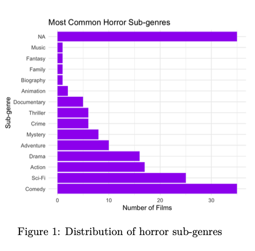

# Horror Movie Analysis: Data-Driven Strategy

**Statistics for Data Scientists (JBP061-B-6)** – Jheronimus Academy of Data Science  
**Angelo Filiol de Raimond** – June 2025  

---

### Overview  
Analyzed **TidyTuesday IMDb horror dataset (n=169 films)** using **R**.  
Goal: Identify production factors driving **audience exposure** (log votes).  

**Key Findings**  
- **Sub-genre**: Horror-Comedy & Horror-Sci-Fi = +1.7 log votes  
- **Runtime**: **60–89 min** films get **most exposure**  
- **Ratings**: No correlation with popularity (-0.25)  

---

### Methods  
- Data: `tidytuesdayR::tt_load('2024-10-29')`  
- Cleaning: Filter horror, remove NA/duplicates  
- Features: `sub_genre`, `duration_group`, `log_votes`  
- Model: `lm(log_votes ~ rating + runtime + sub_genre + duration_group)`  
- Tools: `tidyverse`, `ggplot2`, `broom`, `patchwork`  

---

### Results  
| Factor       | Takeaway                          |
|--------------|-----------------------------------|
| Sub-genre    | Comedy/Sci-Fi hybrid = more exposure |
| Duration     | 60–89 min outperform others       |
| Ratings      | Do not drive vote count           |

---

### Visual Results  

  
*Audience exposure (n=169 films)*

  
*IMDb ratings distribution*

  
*Top horror sub-genres by count*

---

### Files  
- [`horror_analysis.R`](horror_analysis.R) → Full R script  
- [`report.pdf`](report.pdf) → Academic report (14 pages)  
- [`quarto_support.pdf`](quarto_support.pdf) → Quarto doc with code

### Run the Code  
```r
library(tidyverse); library(tidytuesdayR)
tuesdata <- tt_load('2024-10-29')
# See horror_analysis.R
